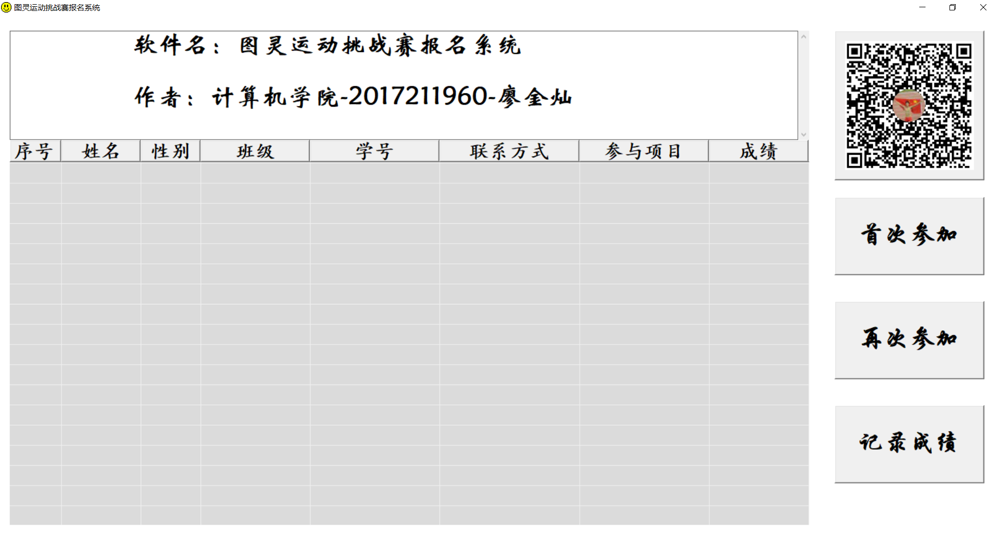
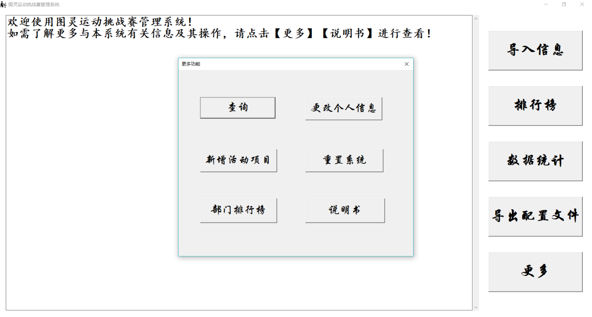
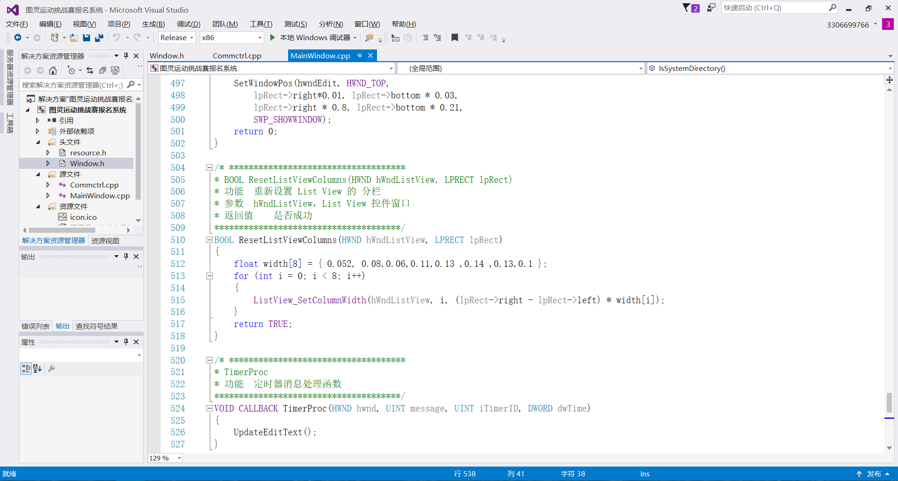
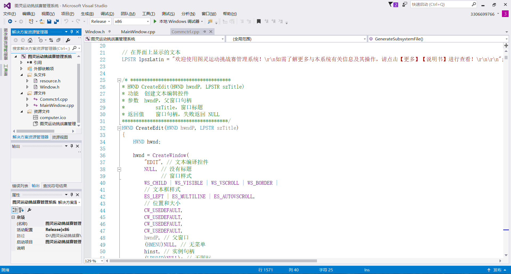

# TulingIntegratedManagementSystem
图灵运动挑战赛管理系统是为进一步提高图灵运动挑战赛活动影响力，同时节省人力成本，专门为此活动设计的一套应用于Windows环境下的软件系统。
图灵运动挑战赛是重庆邮电大学计算机科学与技术学院团总支学生会围绕“三走”系列号召所开展的持续性的体育活动，旨在通过挑战赛的方式，达到让学生走出寝室，走下网络，走向操场的目的。

